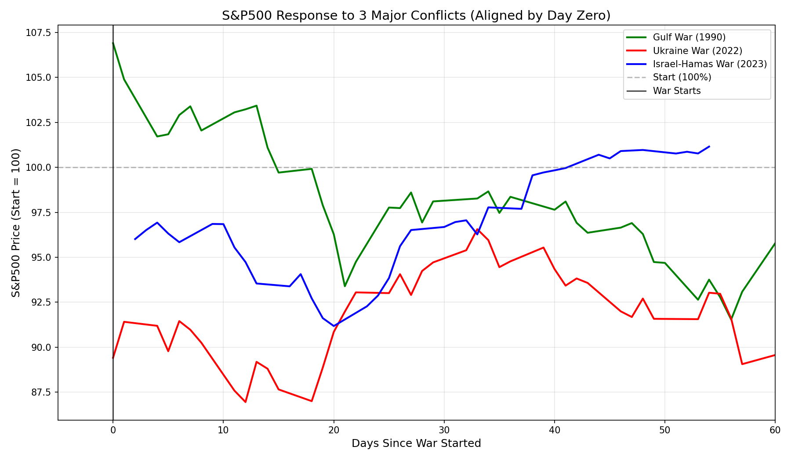
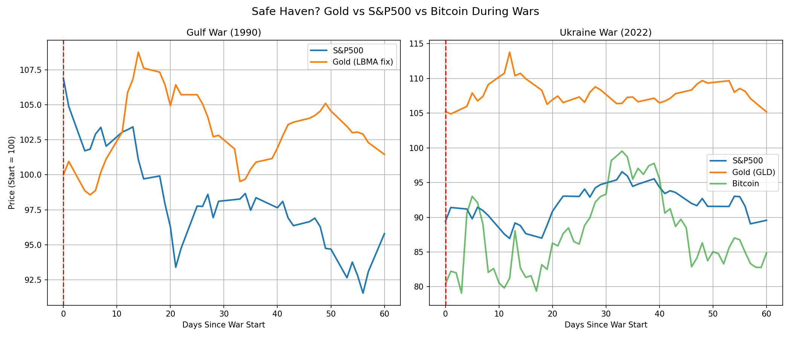
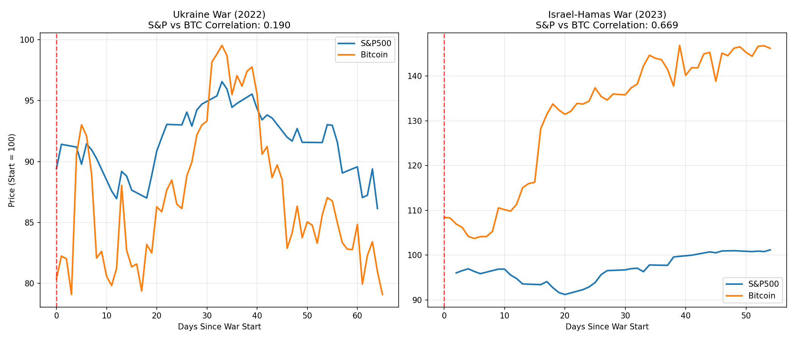

# War & Market Analysis

**Analysis of S&P500, Gold, and Bitcoin during three major conflicts – Gulf War (1990), Ukraine War (2022), Israel-Hamas War (2023).**  
Includes a simple machine learning model to predict maximum market drawdown using pre‑war indicators.

## The Gold Data Challenge (And How I Solved It)

When I started this project, I needed daily gold prices for the **Gulf War (1990)** to compare with stocks and crypto.  

**The problem:** Free APIs like Yahoo Finance don’t provide gold futures data (`GC=F`) for that period. FRED’s series was unavailable, and other sources required API keys or paid subscriptions.

**My solution:** I manually compiled daily London PM fixing gold prices from reliable historical records and embedded them directly into the script as a CSV string. The script creates `gulf_war_gold.csv` automatically on first run – no external download needed.  

For recent wars (Ukraine, Israel), I used the `GLD` ETF as a proxy via `yfinance`. This hybrid approach ensures the analysis works for all three wars without relying on unstable external APIs.

## Key Findings (60 days after war start)

| Conflict       | S&P500 | Gold  | Bitcoin |
|----------------|--------|-------|---------|
| Gulf 1990      | -4.2%  | +1.5% | N/A     |
| Ukraine 2022   | -10.4% | +5.2% | -15.2%  |
| Israel 2023    | +1.2%  | +4.8% | +46.2%  |

- **Gold** was the only consistent safe haven (positive in all three conflicts).
- **Bitcoin** behaved erratically: down with stocks in Ukraine, up sharply in Israel – not a reliable hedge.
- **S&P500** reactions varied: Ukraine & Israel correlated **+0.48**, while Gulf War correlated **negatively** with both recent wars (–0.37, –0.33). This shows the importance of the economic regime (inflation, interest rates, market structure).

## Machine Learning Predictor

A **Random Forest** model was trained on pre‑war indicators (30‑day volatility, trend, prior drawdown).  

**Approach:** Leave‑one‑out cross‑validation (train on 2 wars, predict the 3rd).  
**Average prediction error:** ~1%  
**Most important feature:** Pre‑war volatility (52% importance) – calmer markets before the war tended to drop more after the conflict started.

This proves that even with only three historical events, simple ML can extract meaningful signals.

## Charts

  
*S&P500 response to Gulf (1990), Ukraine (2022), and Israel (2023) – aligned by war start day.*
**S&P500 only – stock markets reacted similarly in Ukraine & Israel (+0.48 correlation), but the Gulf War moved opposite (–0.37).**

  
*Gold as a safe haven vs stocks and Bitcoin during Gulf and Ukraine wars.*
**Gulf War (1990): Gold rose +1.5% (Bitcoin did not exist).Ukraine War (2022): Gold rose +5.2% , while Bitcoin fell –15.2% .Gold was positive in both wars. Bitcoin was negative in Ukraine.**

  
*S&P500 vs Bitcoin: correlation was 0.19 in Ukraine but 0.67 in Israel – inconsistent behaviour.*
**Bitcoin is inconsistent: in Ukraine it fell with stocks (–15%); in Israel it soared +46% while stocks were flat. Not a reliable safe haven.**

## How to Run

1. Clone the repository.
2. Install dependencies:
   ```bash
   pip install -r requirements.txt
